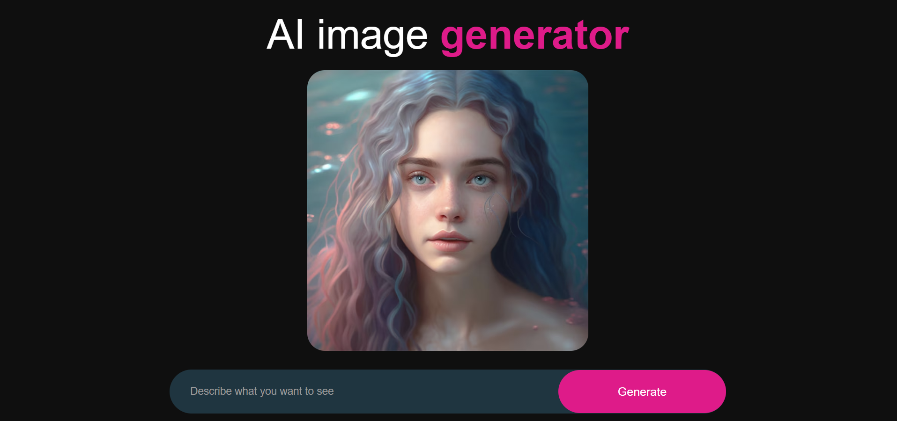
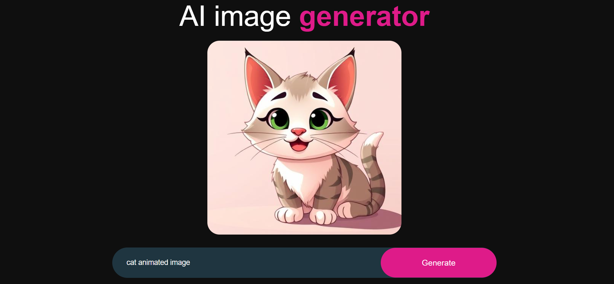
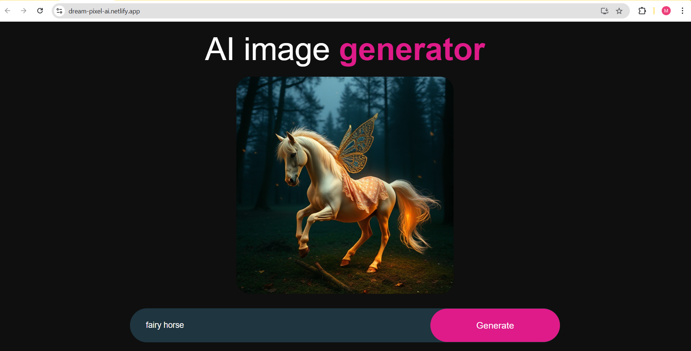

# 🎨 AI Image Generator: Text-to-Image Generator


> Transform your wildest thoughts into high-fidelity digital art. Built with React and powered by cutting-edge Generative AI.

---

## 🚀 Project Overview

**AI Visionary** is a sleek, responsive frontend application that serves as a bridge between human creativity and machine intelligence. Inspired by tools like DALL-E and Midjourney, this project focuses on a seamless user experience: simply describe a scene, and watch the AI bring it to life in high resolution.

### ✨ Key Features

- **Instant Generation:** Real-time API communication for rapid results.
- **Responsive Gallery:** View your creations in a beautiful, adaptive grid.
- **Intuitive UI:** Minimalist design to keep the focus on the artwork.
- **Modern Tech Stack:** Leveraging React hooks for state management and modular CSS for styling.

---

## 🖼️ Preview & Interface

To see the application in action, browse the snapshots below:

<div align="center">
  <table>
    <tr>
      <td><br/><sub><b>Landing Page</b></sub></td>
      <td><br/><sub><b>Generation Result</b></sub></td>
      <td><br/><sub><b>Result</b></sub></td>
    </tr>
  </table>
  <p><i>(Tip: Check the <code>src/Components/Assests</code> folder to swap these with your latest UI updates!)</i></p>
</div>

---

## 📂 Project Architecture

Based on the current structure, the project is organized for scalability:

```text
ai-image-generator/
├── public/                # Static assets & manifest
├── src/
│   ├── Components/
│   │   ├── Assests/       # UI Images & Icons
│   │   └── ImageGenerator/# Core Logic & Component
│   │       ├── ImageGenerator.jsx
│   │       └── ImageGenerator.css
│   ├── App.js             # Main Entry Point
│   └── index.js           # DOM Rendering
└── .env                   # API Keys (Protected)

```

---

## 🛠️ Technology Stack

<p>
  
</p>

- **React.js** – Core framework
- **CSS** – Styling
- **Netlify** – Deployment
- **Image Generation API** – Used for generating AI-based images (e.g., OpenAI, DeepAI, etc.)

---

### 📥 Installation

<details open>
<summary><b>Step 1️⃣ : Clone the Repository</b></summary>

<br/>

```bash
# HTTPS
git clone https://github.com/shekhawatmuskan/ai-image-generator.git


# SSH
git clone git@github.com:shekhawatmuskan/ai-image-generator.git

# GitHub CLI
gh repo clone shekhawatmuskan/ai-image-generator
```

</details>

<details open>
<summary><b>Step 2️⃣ : Navigate to Project Directory</b></summary>

<br/>

```bash
cd ai-image-generator
```

</details>

<details open>
<summary><b>Step 3️⃣ : Install Dependencies</b></summary>

<br/>

```bash
npm install
```

<details open>
<summary><b>Step 4️⃣  : Configure Environment Variables</b></summary>

<br/>

Create a `.env` file in the root directory:

```env
REACT_APP_API_KEY=your_api_key_here
```

If using **Vite**, use:

```env
VITE_API_KEY=your_api_key_here
```

> ⚠️ **Important:** Never commit your `.env` file to version control!
>
> </details>

<details open>
<summary><b>Step 5️⃣ : Launch the Application 🎉</b></summary>

<br/>

```bash
npm start
```

The application will run at:

```
🌐 Local:   http://localhost:3000

```

</details>

---

<br/>

<div align="center">

**If you found this project helpful, please give it a ⭐!**

<br/>
